  <picture>
    <source media="(prefers-color-scheme: dark)" srcset="./dark.svg">
    <source media="(prefers-color-scheme: light)" srcset="./light.svg">
    
  </picture>

<h3 align="center">R. Ruban Edward</h3>

<em>"First, solve the problem. Then, write the code."</em>

---

### About

Software Engineer at **Infiniti Software Solutions**, based in Chennai, India. Focused on backend systems, workflow automation, and full-stack development — working across Python and PHP services, with React on the frontend and cloud deployment on AWS.

- 🎓 B.Tech, Computer and Communication Engineering
- 📍 Chennai, India

---

### Engineering Stack

**Languages** &nbsp; `Python` · `PHP`

**Backend** &nbsp; `FastAPI` · `CodeIgniter`

**Frontend** &nbsp; `React`

**Databases** &nbsp; `MySQL` · `PostgreSQL` · `MongoDB`

**Automation** &nbsp; `n8n`

**Cloud** &nbsp; `AWS`

---

## 📊 GitHub Activity

  

<h2 align="center">Contribution Activity</h2>

  <picture>
    <source
      media="(prefers-color-scheme: dark)"
      srcset="https://raw.githubusercontent.com/Ruban-Edward/github-snake/output/github-contribution-grid-snake-dark.svg"
    />
    <source
      media="(prefers-color-scheme: light)"
      srcset="https://raw.githubusercontent.com/Ruban-Edward/github-snake/output/github-contribution-grid-snake.svg"
    />
    
  </picture>

---

### Connect

| | |
|---|---|
| 🐙 GitHub | [github.com/Ruban-Edward](https://github.com/Ruban-Edward) |
| 💼 LinkedIn | [linkedin.com/in/ruban-edward](https://www.linkedin.com/in/ruban-edward/) |
| 🌐 Portfolio | [ruban-edward.github.io](https://ruban-edward.github.io/) |
| ✉️ Email | [rubanedward769@gmail.com](mailto:rubanedward769@gmail.com) |
