  <picture>
    <source media="(prefers-color-scheme: dark)" srcset="./main.svg">
    <source media="(prefers-color-scheme: light)" srcset="./main-light.svg">
    
  </picture>

  <picture>
    <source media="(prefers-color-scheme: dark)" srcset="./about-life.svg">
    <source media="(prefers-color-scheme: light)" srcset="./about-life-light.svg">
    
  </picture>

  <picture>
    <source media="(prefers-color-scheme: dark)" srcset="./stack.svg">
    <source media="(prefers-color-scheme: light)" srcset="./stack-light.svg">
    
  </picture>

---

## 📊 GitHub Activity

  

<h2 align="center">Contribution Activity</h2>

  <picture>
    <source
      media="(prefers-color-scheme: dark)"
      srcset="https://raw.githubusercontent.com/Ruban-Edward/Ruban-Edward/output/github-contribution-grid-snake-dark.svg"
    />
    <source
      media="(prefers-color-scheme: light)"
      srcset="https://raw.githubusercontent.com/Ruban-Edward/Ruban-Edward/output/github-contribution-grid-snake.svg"
    />
    
  </picture>

---

### Connect

  
  
  
  

